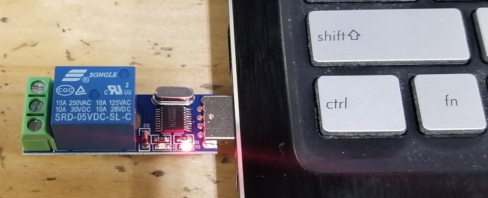

**Portable a.i witness attests to humanity, membership, ownership and status without leaking identity or personal data.**

**Problem Statement:**
Without Revealing Your Identity or biometric data,
Prove You Are Human,
That You Have The Right To Vote In A Given Jurisdiction,
And That You Have Not Yet Cast Your Ballot,

**Background:**
The last job I had before retiring was chief controls tech at a robotic sort center.
My only job was to keep everything running but I got bored and built an a.i. system to detect bunched up packages and eject them from the system to prevent mis-sorting.

Formerly this was done by humans and they hated the job because it required intense concentration and yet was very boring so it put them to sleep.   

This video was taken while I was training the a.i.    
You can see in the video linked below the poor man falling asleep with the yellow control box in his hand.   

<a href="https://youtu.be/86aRFeI_Tys" target="_blank">   

This was the guy responsible for pressing the button 8 hours a day to reject packages from the conveyor if they were all bunched up and clustered together. He was my motivation for building the a.i.. I wanted to relieve him so that he could do a job more fitting for humans.   

The video below shows the a.i. at work.   

<a href="https://youtu.be/Pq97KxsR0aI" target="_blank">   

If you stop the video at the right moments you can see the clustered packages surrounded by a red bounding box and labeled with the word "Cluster"  
When these are detected, the a.i. triggers a relay in the USB port of the host computer which effectively pushes the same button that the poor sleepy fellow was pushing on his yellow control box.  

  

**The Insight And The Idea:**
So you may be wondering, what does this have to do with an identity solution that can prove you are human, that you have the right to vote in a given jurisdiction, that you have not yet cast your ballot, and all without revealing your identity or biometric data?

The key insight is that the output of the a.i. is not the video. That video was collected to help me see how the a.i. was doing during training but normally that video is not collected and there is no monitor present.

The output of the a.i. is the relay in the USB port that accepts or rejects packages **without revealing any information about the packages** except for the one thing it is trained to detect, whether or not the packages are clustered.

In this case the a.i. is trained to detect clustered packages and that is all the a.i. reveals about the packages even though it sees the names and addresses on the packages and sees its dimensions as well.

And that is the insight. This type of a.i., known as a classifier, can only say whether or not the input matches one or more of the classes it was trained to detect. Nothing else is revealed. No information is leaked.

So with just a little bit of stretching we can imagine an a.i. asking a prospective voter to wiggle their nose and pull on their ear and such in some random order to prove they are human. Finger print readers, signature recogonition, and voice recognition could be used as well with no information leakage as you will see.

Then the a.i. asks to see the individual's driver's license and checks that it matches the features of the individual to prove they are a citizen of the jurisdiction.

Finally, it hashes the individual's driver's license number and provides this to the authority.

The authority checks that no one with that hash has already voted.

That all seems pretty doable but you are probably thinking: "Why would we trust that the ai is not keeping an image of the drivers license or the citizen's biometric data?"

We trust the a.i. because the a.i. is owned and controlled by the individual not by the authority. And it runs behind secure hardware on the individual's phone or similar sized handheld device. 

A.I.s are already built into many brands of smart phones for helping with photos and other tasks. So the tech is already here and largely deployed. 

Everybody has their own open source government certified a.i. which is nothing more than a file containing the pretrained neural network and another file containing a program to run it.

Both files would be identical to the same files on every other citizen's phone and the hash of the files would prove it.

These two files and the process is sequestered behind trusted hardware on the owner's device and reveals nothing but the answers to questions asked by the owner.
Am I human?
Am I a citizen?
What is the hash of my drivers license number?
and so on.

So in much the same way individuals now have hardware wallets as witnesses to prove we have the right to move funds on a blockchain, We will soon own certified a.i. witnesses running on our devices to prove we are human, to prove we are citizens with specific privileges such as uncast ballots or perhaps unclaimed rations, all without leaking our identities or our biometric information.

If the training data is open source, and we all use the same seed for the pseudo-random number generator used to create the weights, and if the hardware is the same, and if we train the model on the data the same number of iterations, then it should be possible for citizens to produce the exact same neural network file with the same hash.

This would prove there is nothing malicious in the neural network file and we would know exactly what data was used to train it.

***Proving Humanity, Citizenship, and whether or not a citizen has already cast a ballot all without revealing identity or biometric information remains an unsolved problem.***

***Who will be the first to develop an open source, (citizen owned), a.i. identity solution for voting, governance, and financial systems - perhaps picking up the job where hardware wallets and other identity systems fall short?***
